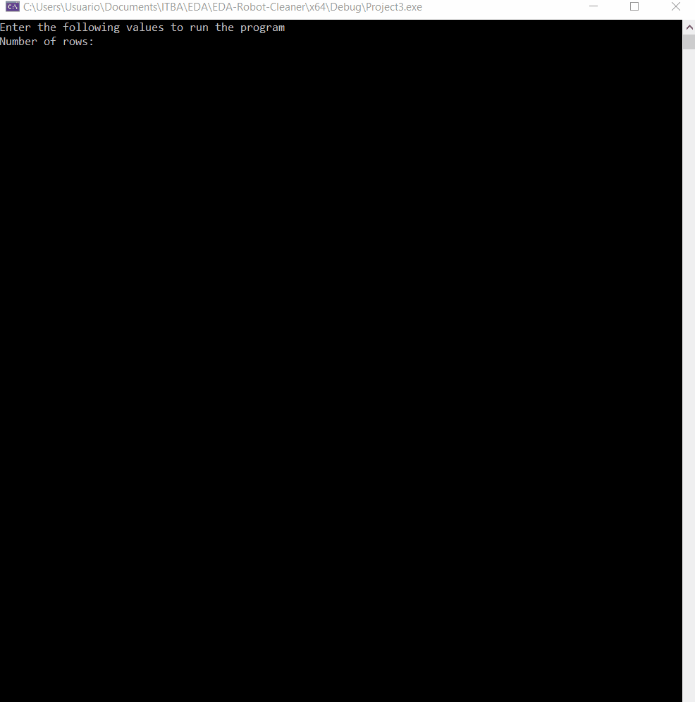
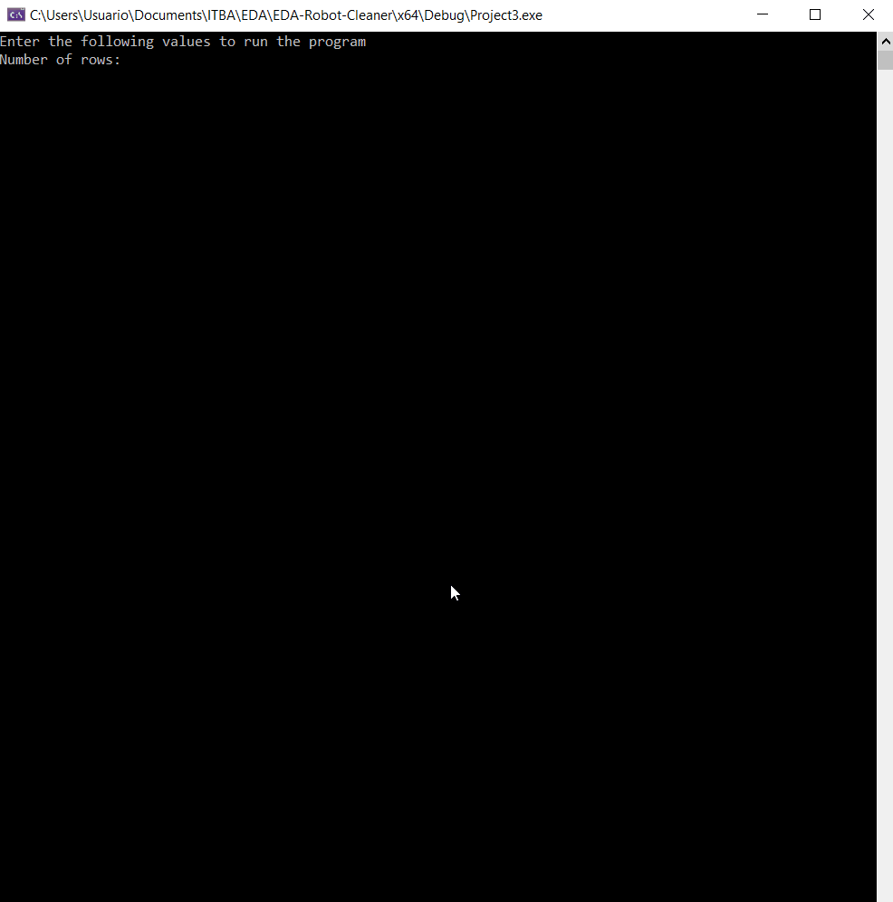
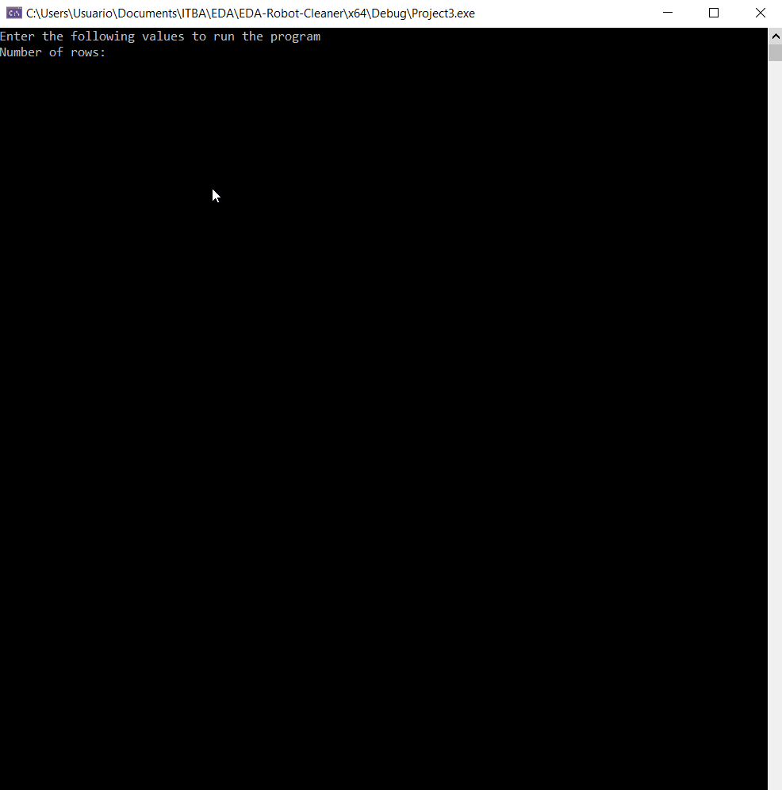

<h1 align="center">
  Robot Cleaner
   
</h1>

<h3 align="center">An application made with C++</a></h3>

  <a href="#what-is-it">What it is</a> •
  <a href="#how-to-run">How to run</a> •
  <a href="#preview">Preview</a> •

 

## What it is

This project seeks to follow the rules found in the purpose.pdf file supplied by Algorithms and Data Structures Course 2020 (ITBA)

The idea behind this project is to create a robot cleaner simulator. The user must enter the number of rows and columns of the floor, the number of robots and the operating mode.

The robots must follow the next rules:

- The robot moves on right line until it collides with a wall (the end of the floor)
- When the robot collides with a wall it has to change its direction, and if when changing it can continue its movement in a straight line it must do so, if this is not the case, it must keep changing position until it can move in that direction.
- In every tick every robot moves one step in its direction or change its direction, when a tick is the time of the program (configured on 9 FPS so 1 tick -> 0.111 seg, you can change this if you want to watch the simulation faster or slower with the define FPS in the file prototipos.h (line 34)).

There are 2 operatings modes, the first one use the number of robots supplied by the user, and with them clear the floor. In this mode the user can watch on the screen the movement of the robots displayed like a dot and an arrow that shows the move direction. When all the floor is cleaned the screen returns the number of tick that it took to complete the task.
the second operating mode calculate the number of thicks that it took in average (with 1000 samples per value) to clean the floor for 1 robot, then for 2 robot, 3, 4, 5, etc. until the diferent on the average number of ticks in the last 2 configuration be less than 0.1 ticks (in average). With the data the program creates an histogram with the number of tick that it took to clear the floor with 1, 2, 3, etc. robots.

## How to Run
the easy way to run this example is open the solution with Visual Studio IDE and tapping Local Windows Debugging button. Another way is compiling the source code by hand with the command console.

## Preview

### Mode 1 with 1 robot:

### Mode 1 with more robots:

### Mode 2:

